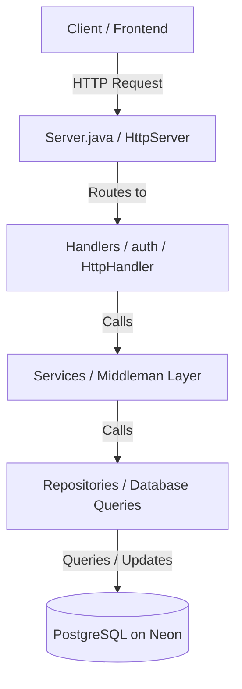

# CP-Station Backend API Documentation & Project Guide

Welcome to the backend codebase of **CP-Station**. This guide serves as a comprehensive developer reference. If you are questioned about this project, this document provides the exact answers on how the database, routing, authentication, and custom architectures function.

---

## 🏛️ Architecture Overview

The codebase is structured using a clean, decoupled **Handler-Service-Repository** pattern in raw Java.



### 1. **HttpServer Layer (`Server.java`)**
* Starts the HTTP server on a specified port (dynamic for Render, fallback to `8080`).
* Registers HTTP endpoint paths (contexts) and maps them to their respective `HttpHandler` controllers.

### 2. **Handlers Layer (`Handlers/` & `auth/`)**
* Implement `com.sun.net.httpserver.HttpHandler` to process incoming HTTP requests.
* Read URL query params (GET) or request bodies (POST/PUT/DELETE), extract input, manage CORS headers, invoke the corresponding Service, and return HTTP status codes and JSON payloads.

### 3. **Services Layer (`Services/`)**
* Act as clean "middlemen" separating API entrypoints from raw database interactions.
* They hold business logic, manage data transformations, and route requests safely to Repositories.

### 4. **Repositories Layer (`Repository/`)**
* Execute raw SQL database queries.
* Check out connections from `DbConnection`, use `PreparedStatement` to prevent SQL injection, execute queries, mapping SQL `ResultSet` rows into Model objects, close the connection, and return data.

---

## 📂 File-by-File Directory Mapping

Here is what every single `.java` file in this backend codebase does:

### Root Directory
* **`Main.java`**: A placeholder entrypoint containing a basic test `main` method.
* **`Server.java`**: The core runtime class. Starts the raw Java `HttpServer`, runs database schema migrations (ensuring `sort_order` columns exist in `topics` and `subtopics`), and registers all API routing contexts.
* **`GetResourcesByTopicsHandler.java`**: A custom endpoint handler that retrieves all resources matching a specified topic or subtopic.
* **`GetSubtopicsByTopics.java`**: An endpoint handler that fetches subtopics under a specific topic, ordered by `sort_order` (handling default `0` values correctly).
* **`AddResourceHandler.java`**: An legacy endpoint handler built specifically for inserting new resources into the database.

### `config/` (Configuration & Connection Pooling)
* [DbConnection.java](file:///Users/farhadmahmud/Desktop/CP-STATION-BACKEND/src/config/DbConnection.java): Houses our custom, thread-safe, proxy-backed database connection pool.
* [Env.java](file:///Users/farhadmahmud/Desktop/CP-STATION-BACKEND/src/config/Env.java): A custom utility that loads environmental variables from the host system or reads them directly from a `.env` file for local development.

### `auth/` (Authentication & Security)
* [PasswordUtil.java](file:///Users/farhadmahmud/Desktop/CP-STATION-BACKEND/src/auth/PasswordUtil.java): Utility that generates secure random Base64 salts and hashes passwords using SHA-256 (no external library required!).
* [SessionUtil.java](file:///Users/farhadmahmud/Desktop/CP-STATION-BACKEND/src/auth/SessionUtil.java): Manages cookie extraction (`session_token`) and session database token lookups/expiry checks.
* [LoginRequest.java](file:///Users/farhadmahmud/Desktop/CP-STATION-BACKEND/src/auth/LoginRequest.java): Standard data object structure for holding parsed login credentials.
* [LoginHandler.java](file:///Users/farhadmahmud/Desktop/CP-STATION-BACKEND/src/auth/LoginHandler.java): Validates user credentials, creates a token in the `sessions` table, and sets an `HttpOnly` session cookie on success.
* [RegisterHandler.java](file:///Users/farhadmahmud/Desktop/CP-STATION-BACKEND/src/auth/RegisterHandler.java): Creates new users, salts and hashes their passwords, and stores them in the `users` table.
* [LogoutHandler.java](file:///Users/farhadmahmud/Desktop/CP-STATION-BACKEND/src/auth/LogoutHandler.java): Deletes the token from the `sessions` table and instructs the browser to delete the cookie by setting the max age to `0`.
* [MeHandler.java](file:///Users/farhadmahmud/Desktop/CP-STATION-BACKEND/src/auth/MeHandler.java): Checks if the user is authenticated via cookie headers, returning their current status and authorization role (`admin` or `user`).

### `models/` (Data Entities)
* [Category.java](file:///Users/farhadmahmud/Desktop/CP-STATION-BACKEND/src/models/Category.java): Simple Java class representing the categories database schema model.
* [Topic.java](file:///Users/farhadmahmud/Desktop/CP-STATION-BACKEND/src/models/Topic.java): Simple Java class representing the topics database schema model.

### `Handlers/` (Endpoints)
* [GetCategoriesHandler.java](file:///Users/farhadmahmud/Desktop/CP-STATION-BACKEND/src/Handlers/GetCategoriesHandler.java): Handles API requests to fetch all category directories.
* [GetTopicsHandler.java](file:///Users/farhadmahmud/Desktop/CP-STATION-BACKEND/src/Handlers/GetTopicsHandler.java): Handles API requests to fetch all topic items.
* [GetTopicsByCategoryHandler.java](file:///Users/farhadmahmud/Desktop/CP-STATION-BACKEND/src/Handlers/GetTopicsByCategoryHandler.java): Handles API requests to fetch topics that fall under a specific category.
* [TopicsCRUDHandler.java](file:///Users/farhadmahmud/Desktop/CP-STATION-BACKEND/src/Handlers/TopicsCRUDHandler.java): Custom REST controller supporting POST, PUT, and DELETE methods for CRUD operations on topics.
* [SubtopicsCRUDHandler.java](file:///Users/farhadmahmud/Desktop/CP-STATION-BACKEND/src/Handlers/SubtopicsCRUDHandler.java): Custom REST controller supporting POST, PUT, and DELETE methods for CRUD operations on subtopics.
* [ResourcesCRUDHandler.java](file:///Users/farhadmahmud/Desktop/CP-STATION-BACKEND/src/Handlers/ResourcesCRUDHandler.java): Custom REST controller supporting POST, PUT, and DELETE methods for CRUD operations on resources.

### `Services/` (Middlemen Logic)
* [CategoryService.java](file:///Users/farhadmahmud/Desktop/CP-STATION-BACKEND/src/Services/CategoryService.java): Coordinates category interactions.
* [TopicService.java](file:///Users/farhadmahmud/Desktop/CP-STATION-BACKEND/src/Services/TopicService.java): Coordinates topic interactions.
* [TopicByCatService.java](file:///Users/farhadmahmud/Desktop/CP-STATION-BACKEND/src/Services/TopicByCatService.java): Coordinates category-specific topic listings.

### `Repository/` (Database Operations)
* [GetCatRepository.java](file:///Users/farhadmahmud/Desktop/CP-STATION-BACKEND/src/Repository/GetCatRepository.java): Raw SQL database queries for categories.
* [GetTopicRepository.java](file:///Users/farhadmahmud/Desktop/CP-STATION-BACKEND/src/Repository/GetTopicRepository.java): Raw SQL database queries for topics.
* [GetTopicByCatRepository.java](file:///Users/farhadmahmud/Desktop/CP-STATION-BACKEND/src/Repository/GetTopicByCatRepository.java): Raw SQL database queries for topics filtered by category ID.

---

## ⚡ Technical deep-dive

### 1. Connection Pool (Zero-Dependency Proxy-Backed Pool)
* **What is it?** We implemented a custom, lightweight database connection pool in [DbConnection.java](file:///Users/farhadmahmud/Desktop/CP-STATION-BACKEND/src/config/DbConnection.java) using a thread-safe `BlockingQueue` and **Java Reflection Proxies**.
* **Why did we build it?** Traditional JDBC connection creation (`DriverManager.getConnection()`) requires a slow TCP, SSL/TLS, and Postgres authentication handshake for every single HTTP request. This adds **300ms–1000ms** of latency. By using a connection pool, we pre-warm the connections and keep them open. Latency is reduced to **under 20ms**.
* **How does it work?**
  * When `getConnection()` is called, it polls an idle connection from the queue. It checks `isValid(2)` to verify the connection is still alive (essential because Neon serverless compute nodes sleep after inactivity).
  * We wrap the physical connection in a dynamic proxy (`java.lang.reflect.Proxy`).
  * When the code calls `.close()` in handlers (e.g. `conn.close()`), the proxy intercepts this call. Instead of closing the actual database socket, it places the physical connection back into the queue (`pool.offer(conn)`) for the next thread to reuse.

---

### 2. External Dependencies (JAR Files in `lib/`)
We have four JAR dependencies inside the `lib/` directory:

1. **`postgresql-42.7.11 (1).jar`**: The PostgreSQL JDBC Driver. Allows Java code to communicate with a remote PostgreSQL database over SQL.
2. **`jackson-core-2.17.2.jar`**: The core streaming JSON parser for the Jackson library.
3. **`jackson-annotations-2.17.2.jar`**: Jackson annotations used to bind JSON properties directly to Java class variables.
4. **`jackson-databind-2.17.2.jar`**: High-level Jackson object mapping. Allows us to convert Java objects directly to JSON bytes and parse JSON strings into Java models/maps.

---

### 3. What is `Map.of` ("MapWrapper") & Why Use It?
* **What is it?** Inside handlers, you will see code like:
  ```java
  Map<String, Object> response = Map.of("loggedIn", true, "role", role);
  byte[] bytes = mapper.writeValueAsBytes(response);
  ```
* **Why use it?** When building APIs, you frequently need to return simple key-value JSON objects (such as `{"success": true}` or `{"error": "Invalid password"}`). Creating a separate, rigid Java class for every single response payload is slow and pollutes the codebase.
* By using `Map.of(...)` (acting as a dynamic Map wrapper), we construct transient key-value pairs inline, and Jackson serializes it directly into standard JSON. It is simple, flexible, and extremely lightweight.

---

### 4. JSON Parsing (GET vs POST API handling)

We handle request parameters differently depending on the HTTP Method:

#### **GET Requests (Query Params)**
* Data is passed via URL query parameters (e.g. `/topics-by-category?categoryId=3`).
* Handled using `exchange.getRequestURI().getQuery()`.
* We parse the query string manually using `.split("&")` and `.split("=")`, then decode the value using `URLDecoder.decode(value, StandardCharsets.UTF_8)` to ensure special characters and spaces are correctly decoded.

#### **POST / PUT / DELETE Requests (Request Body)**
* Data is passed as a raw JSON payload in the request body.
* We read the input stream:
  ```java
  InputStream is = exchange.getRequestBody();
  String body = new String(is.readAllBytes(), StandardCharsets.UTF_8);
  ```
* We parse the JSON using Jackson's `ObjectMapper`:
  ```java
  JsonNode json = mapper.readTree(body);
  String title = json.has("title") ? json.get("title").asText() : "";
  ```
  This reads the JSON structure dynamically, checking for properties safely to prevent null-pointer exceptions.

---

### 5. Server-Side Connection with Raw Java (HttpServer)

* In typical frameworks (like Spring Boot), routing and server management are abstract. Here, we build it directly using Java's built-in **`com.sun.net.httpserver`** package:
  * **`HttpServer`**: The class that binds to an IP address/port and listens for incoming TCP socket connections.
  * **`HttpHandler`**: An interface. Every endpoint must implement this and define a `handle(HttpExchange exchange)` method.
  * **`HttpExchange`**: Represents a single HTTP request-response cycle. It provides helper methods to inspect headers, get URL paths, read the request body, send response headers (`sendResponseHeaders`), and write response data back to the client.
  * **Threading**: We use `server.setExecutor(null)` which instructs the server to run with default executor threads. It executes handlers concurrently, which makes thread-safe database connection pooling (our proxy pool) essential.
